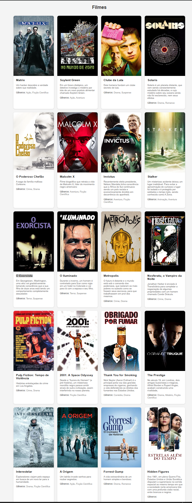

# Aprendizado de novas tecnologias
[código fonte](https://github.com/logicinfocursos/learning_new_techs.git)

## Aprenda a programar novas tecnologias usando o conhecimento que você já tem
Esse projeto é um conjunto de exemplos com o objetivo de ajudar você a aprender novas tecnologias usando a tecnologia que você já conhece. Aprendizado por analogia. 

Dessa forma irei presumir que você já conhece o básico da programação e ao menos uma das tecnologias abordadas neste projeto.

Por exemplo, se você já conhece Node JS, vai ficar fácil aprender python replicando o mesmo projeto na mesma ordem. 

Iremos construir as api's (backend) e os app (frontend).

É imporante que cada tecnologia tem caracteríscitas que muitas vezes não são encontradas em outras. Por exemplo Go e Rust, não implementam o conceito de O.O. (objeto-orientado) e C# e Java não tem o conceito de métodos estáticos.

Em alguns casos, o frontend será web (a nossa prioridade), mas em algumas situações apps desktop ou mobile sejam as melhores opções (por exemplo: Flutter e Dart, electron e node.js).

Talvez quando você encontrar esse material eu ainda esteja gerando dos conteúdos, peço a sua paciência, pois a jornada necessária para criar esse volume de conteúdo é muito grande. Irei iniciar pelo backend...

### Como "rodar" os projetos
Em cada pasta referente ao projeto/tecnologia, você irá encontrar um arquivo readme.md com instruções de como instalar as dependências e executar o projeto.

### API's (backend) 
Para o módulo de apis, cada etapa está númerada e em todos os projetos, mantendo a mesma ordem de execução:
0. Importar as dependências
1. Carregar as variáveis do .env
2. Definir a porta da API
3. Inicializar o framework e ORM (conexão com o banco de dados + estrutura de dados)
4. Configurar os Middlewares (CORS, etc)
5. Definir as rotas da API
6. Inicializar o servidor na porta definida (API_PORT)

Independente da tecnologia escolhida, o código irá seguir essa ordem de execução das etapas.

#### Tecnologias backend
- Node.js com javascript (Framework: Express e ORM: Prisma) "done"
- Node.js com typescript (Framework: Express e ORM: Prisma) "done"
- Node.js com typescript (Framework: nest js e ORM: sequelize) "to do"
- Node.js com typescript (Framework: Fastify e ORM: typeORM) "to do"
- Python (Framework: FastAPI e ORM: SQLAlchemy)  "to do"
- Python (Framework: Flask e ORM: SQLAlchemy) "to do"
- Python (Framework: Django e ORM: Django ORM) "to do"
- Go (Framework: Gin e ORM: GORM) "done"
- PHP (Framework: Slim e ORM: Doctrine) "done"
- PHP (Framework: Laravel e ORM: Eloquent) "to do"
- Ruby (Framework: Ruby on Rails e ORM: ActiveRecord) "to do"
- Rust (Framework: Rocket e ORM: Diesel) "doing"
- Java (Framework: Spring Boot e ORM: Hibernate) "to do"
- C# (Framework: ASP.NET Core e ORM: Entity Framework) "to do"
- c++ (Framework: Qt e ORM: QtSql) "to do"
- dart / flutter (Framework: Flutter e ORM: Hive) "to do"

### APP's (frontend)
Os apps terão a mesma funcionalidade básica listar os registros obtidos pelas apis. Todos os apps web irão usar o mesmo css para garantir que todos tenham a mesma aparência final e como nos projetos de backend, os projetos de frontend tentarão serguir o mesmo padrão independente da tecnologia escolhida.

#### Tecnologias frontend
- node js com javascript, express e ejs - web "done"
- react & next js com javascript - web  "to do"
- react & next js com typescript - web  "to do"
- react native & expo js com javascript - mobile  "to do"
- react native & expo js com typescript - mobile  "to do"
- react native & expo js com typescript - TypeORM (persistência local com SQLite)  "to do"
- electron js com javascript - desktop  "to do"
- electron js com typescript - desktop  "to do"
- Python & flask - web  "done"
- Go  - web  "done"
- PHP  - web  "done"
- Ruby   - desktop  "to do"
- Rust  - desktop  "to do"
- Java  - web  "to do"
- C# - web  "to do"
- dart / flutter - mobile  "to do"
- kotlin - Kotlin Multiplatform (KMP) / Room (persistência local com SQLite)  "to do"

